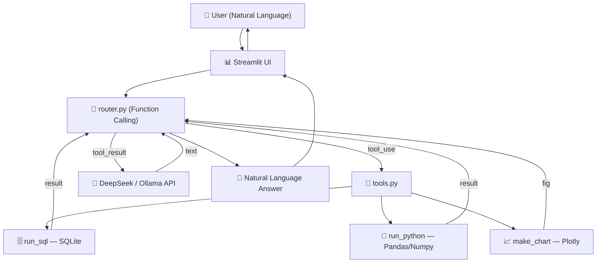

# 🏨 Hotel Booking Analysis Agent

> Natural language interface for hotel booking data analysis — ask questions in plain Chinese/English, get insights and charts instantly.


---

## Demo

| Query | Result |
|-------|--------|
| "各月取消率的趋势是什么？" | Line chart of monthly cancellation rate |
| "取消率最高的前5个国家" | Bar chart of top-5 countries by cancellation rate |
| "画出 lead_time 的分布直方图" | Histogram of lead time distribution |
| "City Hotel 和 Resort Hotel 的平均 ADR 对比" | Comparative bar chart |

> *Demo GIF / Screenshot — to be added*

---

## Features

- **Natural Language → Analysis** — ask questions like "check cancellation correlation with lead time" and get an answer with charts, no SQL or Python required.
- **Three Intelligent Tools** — the Agent automatically chooses between SQL query, Python analysis, or charting based on your intent.
- **Multi-turn Conversation** — context-aware follow-up questions with full chat history management.
- **Agent Loop with Tool Feedback** — tool results are fed back to the LLM for natural language interpretation, not dumped raw.
- **Safe Code Execution** — Python analysis runs in a sandboxed environment with import whitelisting.
- **Rule-based Fallback** — works without any API key using keyword matching for basic queries.
- **Streamlit Cloud Ready** — deploy with one click, configure via `secrets.toml`.

---

## Tech Stack



**Core stack:**
- **Frontend:** [Streamlit](https://streamlit.io) — rapid UI with chat interface
- **LLM:** [DeepSeek API](https://platform.deepseek.com) / Ollama local — OpenAI-compatible function calling
- **Data:** Pandas, Numpy, SQLite (in-memory)
- **Visualization:** Plotly Express
- **Agent Pattern:** Function Calling with tool result feedback loop

---

## Quick Start

### 1. Clone & install

```bash
git clone https://github.com/your-username/hotel-analysis-agent.git
cd hotel-analysis-agent
pip install -r requirements.txt
```

### 2. Configure LLM backend

**Option A — DeepSeek API (recommended, has free credits):**
```bash
cp .env.example .env
# Edit .env with your DeepSeek API key
```

Get your key at [platform.deepseek.com/sign_up](https://platform.deepseek.com/sign_up).

**Option B — Rule-based mode (no API key needed):**
Just skip the API key — the app falls back to keyword matching.

### 3. Run

```bash
streamlit run app.py
# or
python -m streamlit run app.py
```

### 4. Ask questions

Load the demo dataset ("🏨 加载酒店演示数据") and try:
- "各月取消率的趋势是什么？"
- "取消率最高的前5个国家"
- "画出 lead_time 的分布直方图"
- "City Hotel 和 Resort Hotel 的平均 ADR 对比"

---

## Deployment (Streamlit Cloud)

### 1. Push to GitHub

```bash
git init
git add .
git commit -m "Initial commit"
git remote add origin https://github.com/your-username/hotel-analysis-agent.git
git push -u origin main
```

### 2. Deploy on Streamlit Cloud

1. Go to [share.streamlit.io](https://share.streamlit.io)
2. Sign in with GitHub
3. Click **"New app"** → select your repo
4. Set:
   - **Main file path:** `app.py`
   - **Python version:** 3.11+

### 3. Add secrets

In the Streamlit Cloud dashboard → **Settings → Secrets**, add:

```toml
DEEPSEEK_API_KEY = "sk-your-deepseek-api-key"
DEFAULT_BACKEND = "deepseek"
```

### 4. Done!

Your app will be live at `https://your-username-hotel-analysis-agent.streamlit.app`

---

## Project Structure

```
hotel-agent/
├── app.py                        # Streamlit entry point
├── agent/
│   ├── __init__.py
│   ├── router.py                 # Agent loop: intent → tool execution → LLM interpretation
│   ├── router_fallback.py        # Keyword-based fallback (no API key needed)
│   ├── tools.py                  # Three tools: run_sql / run_python / make_chart
│   └── prompts.py                # All system prompts
├── data/
│   └── hotel_bookings.csv        # Demo dataset (119,390 rows, 32 columns)
├── .streamlit/
│   └── secrets.toml.example      # Streamlit Cloud secrets template
├── .env.example                  # Local environment template
├── .gitignore
├── requirements.txt
└── README.md
```

---

## How the Agent Loop Works

```
User: "每月取消率趋势是什么？"
                │
    ┌───────────▼───────────┐
    │  router.py            │
    │  messages = schema +  │
    │  sample data + history│
    └───────────┬───────────┘
                │
    ┌───────────▼───────────┐
    │  DeepSeek API         │
    │  (with tool defs)     │
    └───────────┬───────────┘
                │
        ┌───────▼───────┐
        │ tool_calls?   │──No──→ Return text answer
        └───────┬───────┘
                │ Yes
    ┌───────────▼───────────┐
    │ Execute tool          │
    │ (SQL / Python / Chart)│
    └───────────┬───────────┘
                │
    ┌───────────▼───────────┐
    │ Feed result back to   │
    │ LLM → go to top       │
    └───────────────────────┘
```

The loop continues until the LLM returns a pure text response (`finish_reason == "stop"`). This ensures every analysis is accompanied by natural language interpretation, not raw data dumps.

---

## Dataset

The demo dataset is [Hotel Booking Demand](https://www.kaggle.com/datasets/jessemostipak/hotel-booking-demand) from Kaggle:
- **119,390** booking records
- **32** columns including `is_canceled`, `lead_time`, `adr`, `hotel`, `country`, `market_segment`
- Source: Nuno Antonio, Ana Almeida, Luis Nunes (2019)

---

## License

MIT
